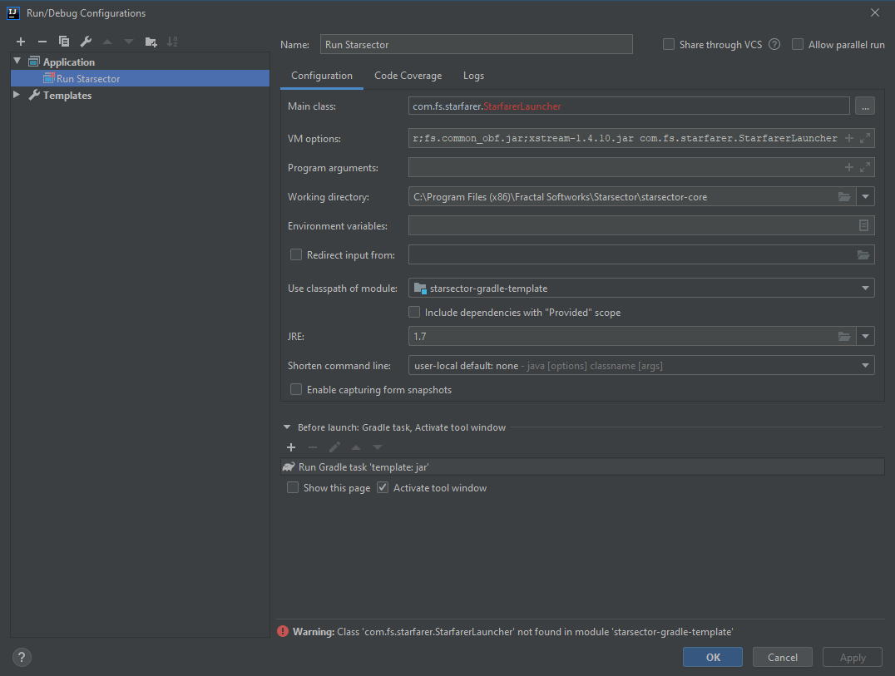

# Starsector Mod Template using Gradle and IntelliJ

## Description

This is a template for a Starsector mod that uses Gradle as its build system, Kotlin as the Gradle DSL, and Kotlin as the programming language.

It will also have a one-click command to build your mod and launch Starsector with full breakpoint debugging.

One of the main goals is to move as much of the build process out of IntelliJ as possible, so that anybody can pull down the source code and build the project with minimal hassle. IntelliJ is not required to build the mod.

Another goal is to have more project configuration as code, rather than IDE-specific files. That way, they'll get versioned (and be shared, as mentioned).

Written for IntelliJ Community. Latest version is 2018.3.4 as of writing.

## Initial Setup Checklist

- Point the build system (Gradle) to the Starsector installation directory:
  - [ ] `build.gradle.kts`: find the `CHANGE ME` section at the top and change `starsectorDirectory` to the location of your Starsector installation.
- Copy (or, preferably, symlink on [mac](https://www.google.com/search?q=how+to+make+symlink+mac), [linux](https://www.google.com/search?q=how+to+make+symlink+linux), or [windows](https://www.google.com/search?q=how+to+make+symlink+windows)) the Starsector API jarfile and source jarfile into the project. This is what allows IntelliJ to display the unobfuscated `.java` files that comprise the modding API when you click "Go To Definition" and allow IntelliJ to display Javadocs for Starsector API classes/methods/variables:
  - [ ] Copy/symlink `starfarer.api.jar` in your Starsector installation's `starsector-core` directory to `libs\starfarer\starfarer-api\1.0\starfarer-api-1.0.jar` (next to `starfarer-api-1.0.pom`).  
  - [ ] Copy/symlink `starfarer.api.zip` in your Starsector installation's `starsector-core` directory to `libs\starfarer\starfarer-api\1.0\starfarer-api-1.0-sources.jar` (next to `starfarer-api-1.0.pom`).
  - That is correct, you should rename the `.zip` file to `.jar`.
  - So, in the end, you should have three files in `libs\starfarer\starfarer-api\1.0`:
    - `starfarer-api-1.0.jar` (renamed from `starfarer.api.jar`)
    - `starfarer-api-1.0.pom` (already present)
    - `starfarer-api-1.0-sources.jar` (renamed from `starfarer-api-1.0-sources.jar`)
  - **IMPORTANT! DO NOT SHARE THOSE TWO JAR FILES.** Do not distribute them with your mod. Do not commit them to git (they're in the `.gitignore`). Sharing them is illegal.
- Change the project and package names to be specific to you:
  - [ ] The easiest way might be to, in IntelliJ, open up `src/main/kotlin/com/example/template`, right-click on the first line (`package com.example.template`) and go to `Refactor - Rename`. From there, you may rename `com.example.template` to anything. If it pops up a refactoring preview, keep everything selected and click `Do Refactor`. 
  - [x] We want to, in `settings.gradle`, change `rootProject.name = 'template'` to be equal to your new name instead (the rename we just did should have already done that).
- Set your mod metadata and jarfile name:
  - [ ] In `build.gradle.kts`, set the value of `jarFileName` to a unique name for your mod, such as `myMod.jar`.
  - [ ] In `mod_info.json`, set `jars` to the same name you just set for `jarFileName`.
  - [ ] In `mod_info.json`, point `modPlugin` to the new package of `LifecyclePlugin` (or delete this line if you do not need a subclass of `BaseModPlugin`).
  
### Optional

- Rename your version file to work with [Version Checker](http://fractalsoftworks.com/forum/index.php?topic=8181.0)
  - [ ] `template.version`: change "template" to the unique name of your mod (eg "myMod.version")
  - [ ] `data/config/version/version_files.csv`: open and change "template.version" to the name of the file you just changed ("eg "myMod.version").
  - [ ] Update your version file (`template.version`) to use data for your mod.
- Change `LICENSE` to something else. [Apache 2](https://tldrlegal.com/license/apache-license-2.0-(apache-2.0)) is a popular one.

## IntelliJ Configuration

### Set up one-click run and debug:

Follow the first two steps of *Ava_N*'s excellent tutorial here: http://fractalsoftworks.com/forum/index.php?topic=10057.msg220052#msg220052, copied and edited here in case the link goes dead.


```text
1. Make a copy of your starsector-core/starsector.bat file and call it "debug-starsector.bat" (replace .bat with .sh for linux). This is not strictly necessary but highly recommended in case the bat file gets messed up.

2. Open the bat file and configure Java to start in a new process and open a debugger port. The "suspend=y" arg in there makes the JVM not run until a debugger actually connects.

Windows:
start ..\jre\bin\java.exe -agentlib:jdwp=transport=dt_socket,server=y,suspend=y,address=5005 <everything that comes after "java.exe" in the original file>

Linux:
..\jre\bin\java.exe -agentlib:jdwp=transport=dt_socket,server=y,suspend=y,address=5005 <everything that comes after "java.exe" in the original file> &

Don't forget the & at the end, it's what makes the command run in a separate process.
```

The rest of the steps have been condensed into one, thanks to Gradle.

- Add the one-click run to IntelliJ, which will first build our mod, then launch Starsector in debug mode, and finally attach our debugger to it:
  -  In IntelliJ, click `Run - Edit Configurations`, click the `+` in the top-left and choose "Remote".
  - Name it "Debug Starsector" (or similar)
  - In the "Configuration" tab, in the "Before Launch" tab at the bottom, click "+" and "Run Gradle Task". Choose your gradle project (eg "template"), and for task, choose "jar".
  - Do the same thing but for the task, write "debug-starsector".
  - *optional* In the Logs tab, hit "+" in the top right and browse to your starsector.log file (should be in starsector-core). Alias it whatever you want, but "starsector.log" is probably a good idea.
  - Click Ok. You should now be able to choose Debug Starsector from the Run menu and have it debug Starsector with your mod (don't forget to enable your mod within Starsector).

*Example for the "Active Gates" mod*


## Building The Code

1. Open `build.gradle.kts` in a text editor and change `starsectorDirectory` to point to the location of Starsector on your hard drive.
2. Run `./gradlew jar` from the mod folder (`gradlew.bat jar` on Windows).
   - You must have Java installed to run this step.

## Other

Author: Wispborne

License: [Unlicense](https://github.com/davidwhitman/starsector-mod-template/blob/master/LICENSE)